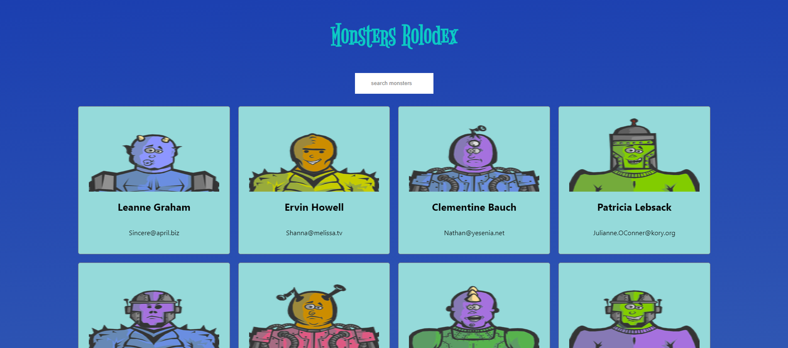

# MonstersRolodex

First project in a series from Udemy Complete React Developer 2020 course.

This project is dynamically searchable data on various monsters.

Hosted on github pages at: <https://agentmrbig.github.io/MonstersRolodex/>
